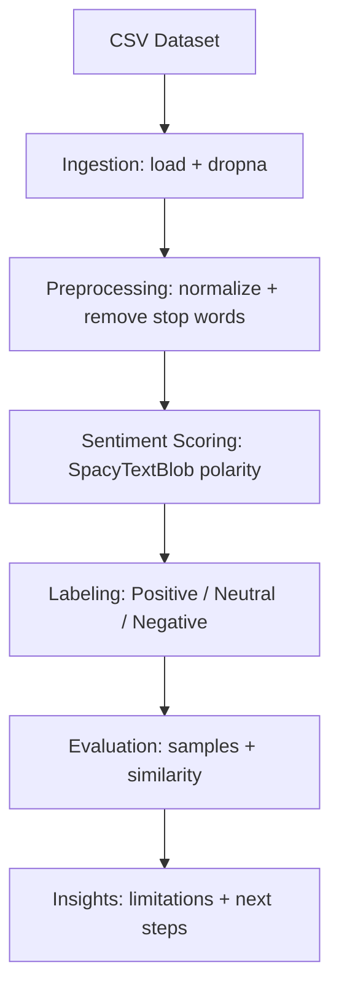

## Amazon Review Sentiment Analysis

Professional sentiment analysis workflow for Amazon product reviews.
The solution is organized as a clean, reproducible notebook suitable
for a GitHub portfolio.

### Highlights
- Uses `en_core_web_md` with spaCy and SpacyTextBlob polarity scoring
- Text preprocessing with stop-word removal, lemmatization, and cleanup
- Labeled sentiment output and review similarity example
- Clear, modular steps documented in the notebook

### Project Structure
- `sentiment_analysis.ipynb`: Notebook workflow and report generation
- `Datafiniti_Amazon_Consumer_Reviews_of_Amazon_Products_May19.csv`: Dataset
- `requirements.txt`: Python dependencies

### Architectural Structure
1. **Ingestion**: Load the CSV and select `reviews.text` with missing values removed.
2. **Preprocessing**: Normalize text, remove stop words and punctuation, lemmatize.
3. **Sentiment Scoring**: Apply SpacyTextBlob to compute polarity.
4. **Labeling**: Map polarity to Positive/Negative/Neutral thresholds.
5. **Evaluation**: Inspect sample predictions and compare review similarity.
6. **Insights**: Note limitations and propose transformer-based improvements.



### Setup
```bash
python3 -m venv .venv
source .venv/bin/activate
python -m pip install -r requirements.txt
python -m spacy download en_core_web_md
python -m textblob.download_corpora
```

### Run the Notebook
Open `sentiment_analysis.ipynb` and run cells top to bottom. The notebook
produces labeled outputs and similarity scores in the output cells.
# amazon-review-sentiment-analysis
