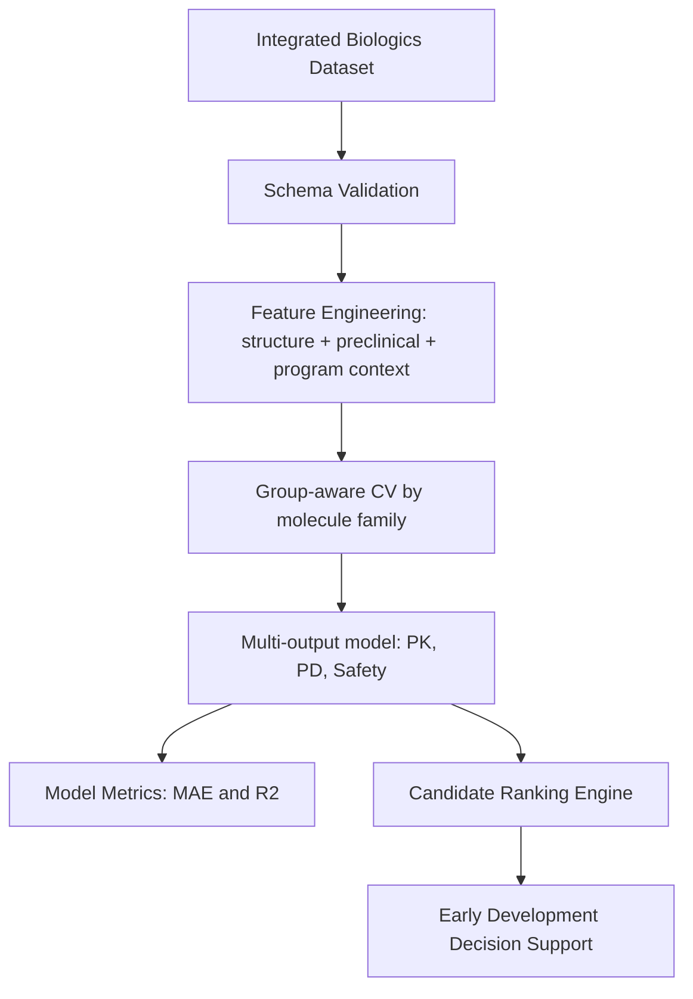

# Biologics Pharmacology AI Engineering Starter

This repository provides an end-to-end AI/ML engineering baseline to
**develop and validate data-driven models that improve decision making across
drug discovery and development**, with a specific focus on
**pharmacology dynamics of large molecules (biologics)**.

The framework integrates:
- **Structural properties** of biologics
- **Preclinical PK/PD features**
- **Clinical outcome targets**

It is designed for cross-functional Quantitative Pharmacology (QP) workflows
supporting multiple therapeutic areas and research platforms.

## Why this project exists

Early development teams need faster, better-informed go/no-go decisions.
This project gives a practical, reproducible baseline for:

1. Analyzing and interpreting integrated preclinical + clinical datasets
2. Designing Biology- and Pharmacology-grounded ML models
3. Validating models with leakage-resistant grouped cross-validation
4. Ranking candidate biologics using a transparent decision score

## Repository structure

```text
biologics_pharmacology/
  __init__.py
  schema.py                # Required columns, features, targets, validation
  modeling.py              # Grouped CV + multi-output model training
  decision_support.py      # Candidate ranking with multi-objective score

scripts/
  generate_synthetic_biologics_data.py  # Synthetic demo data
  train_biologics_model.py              # Train, validate, rank, and save model

tests/
  test_biologics_pipeline.py

biologics_pharmacology_workflow.ipynb  # Step-by-step interactive notebook
```

## Modeling approach

### Inputs
- Structural descriptors (e.g., molecular weight, pI, aggregation propensity)
- Preclinical pharmacology (e.g., clearance, half-life, efficacy, ADA)
- Program context (e.g., modality, therapeutic area, development stage)

### Predicted targets
- `clinical_pk_half_life_day`
- `clinical_pd_response_pct`
- `severe_ae_rate_pct`

### Validation strategy
- **GroupKFold by molecule family** to reduce leakage across related molecules
- Fold-level metrics:
  - Mean Absolute Error (MAE)
  - R²

### Decision support
Predictions are combined into a weighted score:
- Higher predicted PD response = better
- Higher predicted PK half-life = better
- Lower predicted severe AE rate = better

This yields a ranked candidate table for early development prioritization.

## Quickstart

### 1) Install dependencies

```bash
python3 -m venv .venv
source .venv/bin/activate
python -m pip install -r requirements.txt
```

### 2) Generate synthetic biologics data

```bash
python scripts/generate_synthetic_biologics_data.py \
  --output-path data/synthetic_biologics.csv \
  --samples 500 \
  --seed 42
```

### 3) Train + validate models and rank candidates

```bash
python scripts/train_biologics_model.py \
  --data-path data/synthetic_biologics.csv \
  --model-path models/biologics_multitask_model.joblib \
  --splits 5 \
  --top-k 10
```

### 4) Open the Jupyter Notebook walkthrough

Start Jupyter and open:

- `biologics_pharmacology_workflow.ipynb`

```bash
jupyter notebook
```

### 5) Run tests

```bash
pytest -q
```

## Example workflow architecture



## Notes for production extension

- Replace synthetic data with governed internal datasets
- Add uncertainty estimation (e.g., conformal intervals)
- Add model monitoring and drift detection
- Integrate domain priors and mechanistic QSP features
- Add model cards and audit logs for clinical governance
