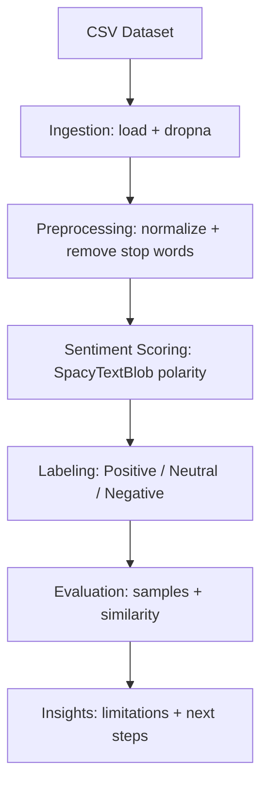

## Amazon Review Sentiment Analysis

Portfolio-ready sentiment analysis on Amazon product reviews using a
reproducible, notebook-first workflow. The project focuses on clean NLP
preprocessing, interpretable sentiment scoring, and clear reporting.

**TL;DR**: A clean, end-to-end NLP notebook that ingests real review data,
cleans it, scores sentiment with SpacyTextBlob, and summarizes results in a
portfolio-ready format.

### Problem Statement and Objectives
Online product reviews contain valuable customer sentiment. This project:
- Extracts and cleans review text from a real-world dataset
- Scores sentiment using a rule-based, explainable approach
- Demonstrates similarity analysis between reviews
- Documents strengths, limitations, and next-step improvements

### Highlights
- Uses `en_core_web_md` with spaCy and SpacyTextBlob polarity scoring
- Text preprocessing with stop-word removal, lemmatization, and cleanup
- Labeled sentiment output plus a review similarity comparison
- Clear, modular steps with outputs shown in the notebook

### Key Skills Demonstrated
- Data cleaning and preprocessing for NLP
- spaCy pipeline setup and sentiment scoring
- Interpretable classification with polarity thresholds
- Result communication and technical documentation

### Project Structure
- `sentiment_analysis.ipynb`: Notebook workflow and analysis
- `Datafiniti_Amazon_Consumer_Reviews_of_Amazon_Products_May19.csv`: Dataset
- `requirements.txt`: Python dependencies

### Methodology
1. Load the dataset and select the `reviews.text` column
2. Drop missing values
3. Normalize and clean text (lowercase, strip, stop-word removal)
4. Compute polarity with SpacyTextBlob
5. Map polarity to Positive / Neutral / Negative labels
6. Compare similarity between two sample reviews

### Dataset and Preprocessing
- Dataset: Datafiniti Amazon Consumer Reviews (May 2019)
- Feature used: `reviews.text`
- Cleaning steps:
  - Convert to string, lowercase, strip whitespace
  - Remove stop words and punctuation
  - Lemmatize remaining tokens

### Results and Example Output
The notebook prints labeled samples and polarity scores, for example:
```
Review Index: 0
Sentiment: Negative
Polarity Score: -0.70
```
This provides a quick, interpretable view of sentiment strength.

### Architectural Structure
1. **Ingestion**: Load the CSV and select `reviews.text` with missing values removed.
2. **Preprocessing**: Normalize text, remove stop words and punctuation, lemmatize.
3. **Sentiment Scoring**: Apply SpacyTextBlob to compute polarity.
4. **Labeling**: Map polarity to Positive/Negative/Neutral thresholds.
5. **Evaluation**: Inspect sample predictions and compare review similarity.
6. **Insights**: Note limitations and propose transformer-based improvements.



### Reproducibility
```bash
python3 -m venv .venv
source .venv/bin/activate
python -m pip install -r requirements.txt
python -m spacy download en_core_web_md
python -m textblob.download_corpora
```

### Run the Notebook
Open `sentiment_analysis.ipynb` and run cells top to bottom. The notebook
produces labeled outputs and similarity scores in the output cells.

### Limitations and Next Steps
- Rule-based polarity can miss sarcasm or domain-specific nuance
- Neutral threshold can be tuned with labeled validation data
- A natural extension is fine-tuning transformer models (e.g., BERT)
